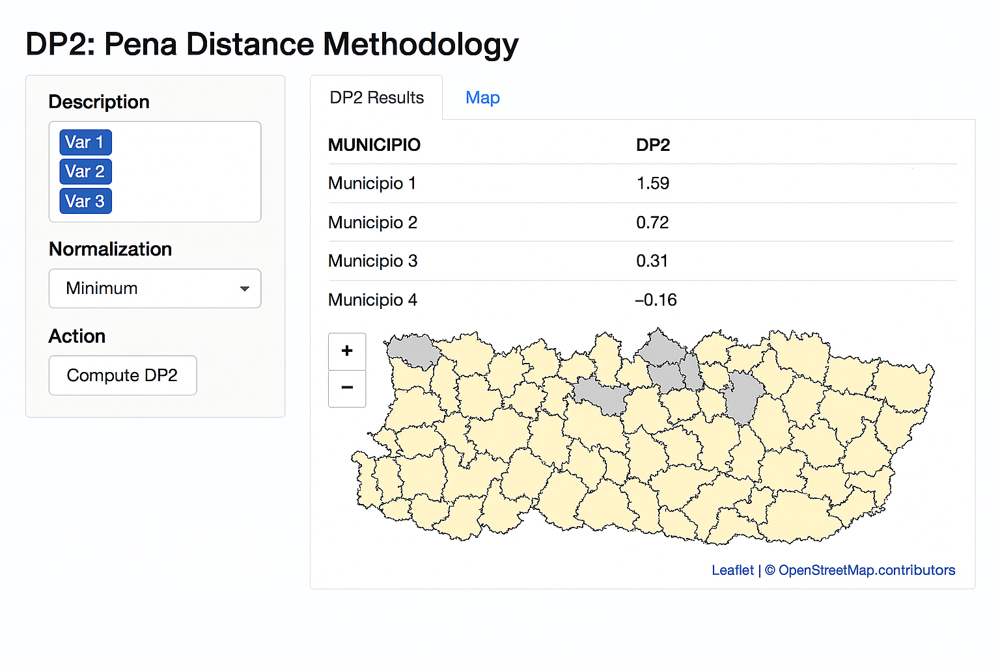

# DP2: Pena Distance Methodology Shiny App

## Description
This Shiny application computes the DP2 index (Pena Distance Methodology) for multidimensional analysis. It allows normalization using minimum or maximum reference values, exports results to Excel, and visualizes them on an interactive map.

## Features
- Compute DP2 index for selected variables
- Choose normalization reference (minimum or maximum)
- Export results to Excel
- Interactive map visualization using shapefiles
- Clickable polygons to identify municipalities

## Installation
```bash
# Clone the repository
git clone https://github.com/yourusername/dp2-shiny-app.git

# Install required R packages
install.packages(c("shiny", "sf", "readxl", "writexl", "dplyr", "leaflet"))
```

## Usage
Run the app locally:
```R
shiny::runApp("app.R")
```

## Input Files
- **Excel file** containing variables for DP2 calculation
- **Shapefile** with polygons and fields:
  - `CODITO` (join key)
  - `MUNICIPIO` (for identification)

## File Structure
```
dp2-shiny-app/
│
├── app.R                # Main Shiny app
├── data/                # Input data files
├── www/                 # CSS or images
└── README.md            # Documentation
```

## Citation
Chasco, C., & Sánchez, B. (2025). *DP2: Pena Distance Methodology (1.0.0)* [Data set]. B2SHARE.  
https://doi.org/10.23728/b2share.1e1hy-ta519  
*Developed with the assistance of Copilot AI (2025).*

## License
This repository uses **dual licensing**:
- **Code**: [MIT License](https://opensource.org/licenses/MIT)
- **Documentation and data**: [Creative Commons Attribution 4.0 International (CC BY 4.0)](https://creativecommons.org/licenses/by/4.0/)

## Methodology
The DP2 (Pena Distance) methodology is an iterative approach that assigns weights to partial indicators based on their correlation with a global index, eliminating redundant variance and ensuring multidimensional comparability. It is widely used for quality of life and socioeconomic indicators.

For a detailed explanation of the method, see the full document:  
(Full Methodology PDF)


---

## Screenshot

