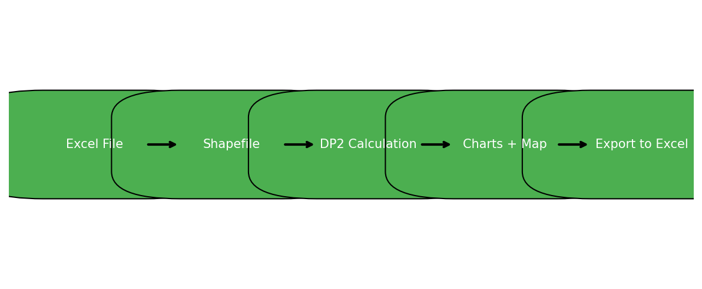

# DP2: Pena Distance Methodology Shiny App

## Description
This Shiny application computes the **DP2 index (Pena Distance Methodology)** for multidimensional analysis. It supports iterative weighting, normalization using minimum or maximum reference values, and provides advanced visualization and export options.

## Key Features
- ✅ Compute DP2 index for selected variables.
- ✅ Choose normalization reference (**minimum** or **maximum**).
- ✅ Export results to Excel with **multiple sheets**:
  - Final Index, Correlations, Weights, Iterations.
- ✅ Interactive map visualization using shapefiles.
- ✅ Clickable polygons to identify municipalities.
- ✅ Additional charts:
  - Histogram of DP2 index.
  - Evolution of DP2 across iterations.
- ✅ Advanced export:
  - Includes charts and map as images in the Excel file.
- ✅ Convergence control:
  - Adjustable tolerance (`tol`) and maximum iterations (`max_iter`).
  - Warning if convergence is not reached.

---

## Installation
```bash
# Clone the repository
git clone https://github.com/yourusername/dp2-shiny-app.git

# Or download ZIP and open app.R in RStudio
# Install required R packages
install.packages(c("shiny", "sf", "readxl", "openxlsx", "ggplot2", "dplyr", "leaflet", "viridis", "shinycssloaders"))

# For map export (optional):
install.packages(c("mapview", "webshot2"))
```

---

## Usage
Run the app locally:
```R
shiny::runApp("app.R")
```

Or access the published version:
**https://coro-chasco.shinyapps.io/dp2-shiny-app/**

---

## Input Files
- **Excel file**:
  - First column: Join key (e.g., `CODE`).
  - Remaining columns: Variables for DP2 calculation.
- **Shapefile (.zip)**:
  - Must include:
    - `CODE` (join key).
    - `MUNICIPIO` (municipality name for popups).

---

## Output
The app generates an Excel file: **DP2_outcomes_iterations.xlsx** with:
- **Final Index**: ID and DP2 values (scaled as IBS = 100 × DP2 / mean).
- **Correlations**: Matrix of correlations between variables.
- **Correlations with DP2**: Correlation of each variable with DP2.
- **Final Weights**: Variable weights and order of inclusion.
- **Iteration_X**: DP2 values, weights, and order for each iteration.

---

## Convergence Settings
- `tol`: Convergence threshold (default: 1e-6).
- `max_iter`: Maximum iterations (default: 100).
If convergence is not reached, a warning is displayed.

---

## License
- **Code**: MIT License.
- **Documentation and data**: CC BY 4.0.

---

## Citation
Chasco, C., & Sánchez, B. (2025). DP2: Pena Distance Methodology (1.0.1). B2SHARE.  
[https://b2share.eudat.eu/records/8cm9h-ghq25](https://b2share.eudat.eu/records/8cm9h-ghq25)

---

## Diagram of Workflow


**Workflow:**
```
Excel + Shapefile → DP2 Calculation → Charts + Map → Export to Excel
```

---

## Screenshot

